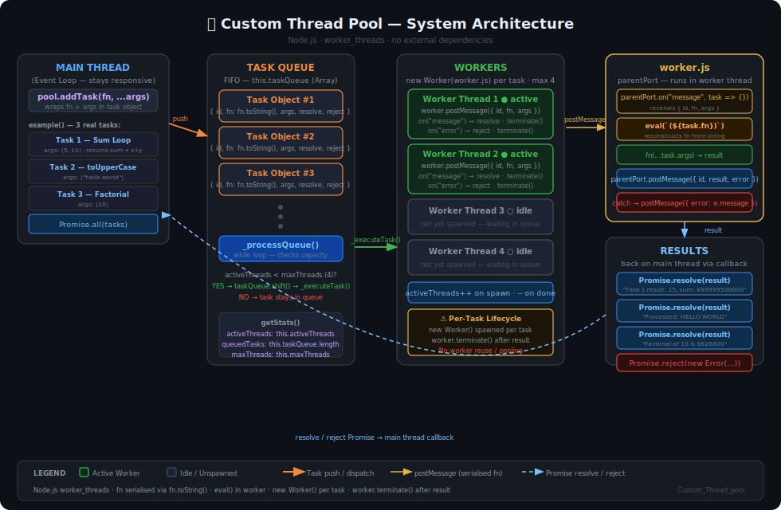

# 🧵 Custom Thread Pool in Node.js

A lightweight, CPU-aware thread pool implementation built from scratch using Node.js `worker_threads`. Built to understand low-level concurrency — and because documentation can't replace building it yourself.

---

## 🤔 What Is a Thread Pool?

A thread pool is a group of pre-initialized workers that wait for tasks. Instead of spinning up a new thread for every job (expensive), you reuse a fixed set of workers.

Think of it like a team of developers and a ticket queue — when a worker is free, it grabs the next task.

---

## 🏗️ System Architecture



> **Flow:** Main thread pushes tasks → Queue holds them → `_processQueue()` dispatches to free workers → Workers serialize & execute → Promise resolves back on the main thread.

---

## ✨ Features

- **CPU-aware sizing** — defaults to `os.cpus().length` workers
- **Task queue** — tasks wait if all workers are busy, then execute automatically
- **Promise-based API** — `await pool.addTask(fn, ...args)` just works
- **Error handling** — worker errors are caught and forwarded as rejected promises
- **Pool stats** — inspect active threads and queue length at any time

---

## 📦 Installation

```bash
git clone https://github.com/mohit-100/Custom_Thread_pool.git
cd Custom_Thread_pool
node threadPool.js
```

No dependencies required — uses Node.js built-ins only (`worker_threads`, `os`).

> Requires **Node.js v12+** for `worker_threads` support.

---

## 🚀 Usage

```js
const pool = new ThreadPool(4); // 4 workers (or omit to use CPU count)

// Add a CPU-heavy task
const result = await pool.addTask((x, y) => {
    let sum = 0;
    for (let i = 0; i < 1_000_000; i++) sum += i;
    return `Result: ${x + y}, sum: ${sum}`;
}, 5, 10);

console.log(result);
// → "Result: 15, sum: 499999500000"
```

### Running multiple tasks in parallel

```js
const results = await Promise.all([
    pool.addTask((x, y) => x + y, 5, 10),
    pool.addTask((text) => text.toUpperCase(), "hello world"),
    pool.addTask((n) => {
        let f = 1;
        for (let i = 1; i <= n; i++) f *= i;
        return f;
    }, 10)
]);

console.log(results);
// → [15, "HELLO WORLD", 3628800]
```

### Checking pool stats

```js
console.log(pool.getStats());
// → { activeThreads: 2, queuedTasks: 3, maxThreads: 4 }
```

---

## 🔧 API

### `new ThreadPool(maxThreads?)`

| Parameter | Type | Default | Description |
|-----------|------|---------|-------------|
| `maxThreads` | `number` | `os.cpus().length` | Max concurrent workers |

### `pool.addTask(fn, ...args) → Promise`

Queues a function for execution in a worker thread. The function and its arguments are serialized and sent to the worker.

> ⚠️ **Note:** Functions are serialized via `.toString()` — closures and external variables are **not** available inside the task function. Pass everything needed as arguments.

### `pool.getStats() → Object`

Returns current pool state:

```js
{
  activeThreads: number,  // Workers currently executing
  queuedTasks: number,    // Tasks waiting for a free worker
  maxThreads: number      // Pool capacity
}
```

---

## 💡 When Should You Use This?

| Use Case | Good Fit? |
|----------|-----------|
| Heavy math / data processing | ✅ Yes |
| Parsing large files | ✅ Yes |
| Image/video processing | ✅ Yes |
| Database queries | ❌ Use async/await instead |
| Network requests | ❌ Use async/await instead |
| Simple string operations | ❌ Overkill |

The event loop handles I/O efficiently on its own. Thread pools shine when you have **CPU-bound work** that would otherwise block the main thread.

---

## 🤯 Things I Learned Building This

- **Thread creation is expensive.** Reusing workers is dramatically faster than spawning new ones per task.
- **Functions become strings.** You can't pass a function reference to a worker — it gets serialized via `.toString()`, which means no closures.
- **The event loop doesn't block.** Even with all workers busy, the main thread stays responsive.
- **Debugging multi-threaded code is chaotic.** `console.log` from 4 threads simultaneously is an experience.

---

## 📁 Project Structure

```
Custom_Thread_pool/
├── threadPool.js                  # ThreadPool class + usage example
├── worker.js                      # Standalone worker script (alternative implementation)
└── thread_pool_architecture.svg   # Architecture diagram
```

---

## 🛠️ How It Works Internally

1. `addTask()` wraps the function in a Promise and pushes it to `taskQueue`
2. `_processQueue()` checks for idle capacity and dispatches tasks to new workers
3. Each worker receives the serialized function + args via `postMessage`
4. The worker evaluates the function, executes it, and posts the result back
5. The main thread resolves or rejects the Promise, then processes the next queued task

---

## 📄 License

MIT — do whatever you want with it.

---

*Built to learn. Inspired by the question: "What actually happens under the hood?"*
